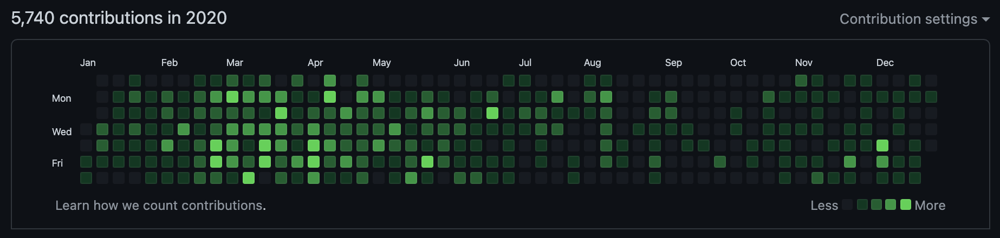

# Import GitLab Commits

[](https://goreportcard.com/report/github.com/alexandear/import-gitlab-commits)
[](https://app.fossa.com/projects/git%2Bgithub.com%2Falexandear%2Fimport-gitlab-commits?ref=badge_shield)

The tool to import commits from private GitLab to separate repo. Can be used to show your programming activity for another company in GitHub.

Check out this informative blog post for a practical use case on how to import GitLab commits [here](https://alexandear.github.io/posts/2023-03-08-import-gitlab-commits/).

## Getting Started

1. Download and install [Go 1.22](https://go.dev/dl/).
2. Install the program by running the command in a shell:

    ```shell
    go install github.com/alexandear/import-gitlab-commits@latest
    ```

3. Set environment variables and run `import-gitlab-commits`:

    ```shell
    export GITLAB_BASE_URL=<your_gitlab_server_url>
    export GITLAB_TOKEN=<your_gitlab_token>
    export COMMITTER_NAME="<Name Surname>"
    export COMMITTER_EMAIL=<mail@example.com>

    $(go env GOPATH)/bin/import-gitlab-commits
    ```

where

- `GITLAB_BASE_URL` is a GitLab [instance URL](https://stackoverflow.com/questions/58236175/what-is-a-gitlab-instance-url-and-how-can-i-get-it), e.g. `https://gitlab.com`, `https://gitlab.gnome.org` or any GitLab server;
- `GITLAB_TOKEN` is a personal [access token](https://docs.gitlab.com/ee/user/profile/personal_access_tokens.html#create-a-personal-access-token);
- `COMMITTER_NAME` is your GitHub name with surname, e.g. `John Doe` (can be passed to `git config user.name`);
- `COMMITTER_EMAIL` is your GitHub email, e.g. `john.doe@example.com` (valid for `git config user.email`);
- `$(go env GOPATH)/bin/` is the path where `import-gitlab-commits` installed.

## Example

Contributions before running `import-gitlab-commits`:


After:



## Internals

What work the tool does:

- gets current user info by `GITLAB_TOKEN`;
- fetches from `GITLAB_BASE_URL` projects that the current user contributed to;
- for all projects fetches commits where author's email is the current user's email;
- creates new repo `repo.gitlab.yourcompany.com.currentusername` and commits all fetched commits with message
`Project: GITLAB_PROJECT_ID commit: GITLAB_COMMIT_HASH`, commit date `GITLAB_COMMIT_DATE`, and commit author `COMMITTER_NAME <COMMITTER_EMAIL>`.

To show the changes on GitHub you need to:

- create a new repo `yourcompany-contributions` in GitHub;
- open folder `repo.gitlab.yourcompany.com.currentusername`;
- add remote url `git remote add origin git@github.com:username/yourcompany-contributions.git`;
- push changes.

### Integration Tests

To run integration tests:

1. Set `GITLAB_TOKEN` environment variables with the value obtained at <https://gitlab.com/-/user_settings/personal_access_tokens>. Necessary scopes:
    - `read_api`;
    - `read_user`;
    - `read_repository`.

2. Set `GITLAB_BASE_URL` with `https://gitlab.com`.
3. Run `make test-integration`.

## License

[](https://app.fossa.com/projects/git%2Bgithub.com%2Falexandear%2Fimport-gitlab-commits?ref=badge_large)
