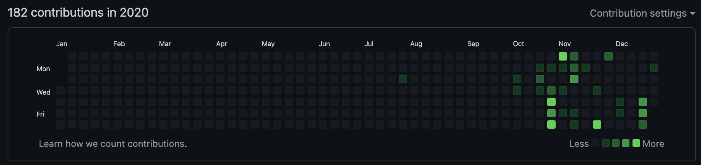
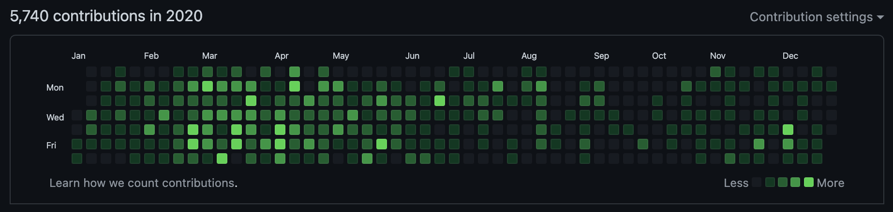

# Import GitLab Commits

[](https://goreportcard.com/report/github.com/alexandear/import-gitlab-commits)

This tool imports commits from a private GitLab repository to a separate repository.
It can be used to showcase your programming activity for another company on GitHub.

Check out this informative blog post for a practical use case on how to import GitLab commits
[here](https://alexandear.github.io/posts/2023-03-08-import-gitlab-commits/).

## Why It's Useful

Contributions before running `import-gitlab-commits`:

<picture>
 <source media="(prefers-color-scheme: dark)" srcset="screenshots/contribs_before_dark.png">
 <source media="(prefers-color-scheme: light)" srcset="screenshots/contribs_before_light.png">
 
</picture>

After:

<picture>
 <source media="(prefers-color-scheme: dark)" srcset="screenshots/contribs_after_dark.png">
 <source media="(prefers-color-scheme: light)" srcset="screenshots/contribs_after_light.png">
 
</picture>

## Getting Started

You can run the tool with Docker or a native Go build.

## Docker Usage

### Docker Compose

Run the tool using Docker Compose:

1. Copy the environment variables template:

    ```shell
    cp .env.example .env
    ```

2. Edit `.env` and configure your credentials.

3. Build and run with [Docker Compose](https://docs.docker.com/compose/install/):

```shell
docker compose up
```

The imported repository will be created in the `output/` directory.

### Plain Docker

Build:

```shell
docker build -t github.com/alexandear/import-gitlab-commits .
```

Run:

```shell
docker run --rm \
    -e GITLAB_BASE_URL="https://gitlab.com" \
    -e GITLAB_TOKEN="<your_gitlab_token>" \
    -e COMMITTER_NAME="John Doe" \
    -e COMMITTER_EMAIL="john.doe@example.com" \
    -v $(pwd)/output:/root \
    github.com/alexandear/import-gitlab-commits
```

### Using native Go build

1. Download and install [Go](https://go.dev/dl/).
2. Install the program by running the following command in a shell:

    ```shell
    go install github.com/alexandear/import-gitlab-commits@latest
    ```

3. Set environment variables and run `import-gitlab-commits`:

    ```shell
    export GITLAB_BASE_URL=https://gitlab.com
    export GITLAB_TOKEN=<your_gitlab_token>
    export COMMITTER_NAME="John Doe"
    export COMMITTER_EMAIL=john.doe@example.com
 
    $(go env GOPATH)/bin/import-gitlab-commits
    ```

Where `$(go env GOPATH)/bin/` is the path where `import-gitlab-commits` is installed.

## Configuration

Configure the tool with these environment variables:

- `GITLAB_BASE_URL` - a GitLab [instance URL](https://stackoverflow.com/questions/58236175/what-is-a-gitlab-instance-url-and-how-can-i-get-it),
e.g., `https://gitlab.com`, `https://gitlab.gnome.org`, or any GitLab server.
- `GITLAB_TOKEN` - a personal [access token](https://docs.gitlab.com/ee/user/profile/personal_access_tokens.html#create-a-personal-access-token) with these scopes: `read_api`, `read_user`, `read_repository`.
- `COMMITTER_NAME` - your GitHub name with surname, e.g., `John Doe` (can be passed to `git config user.name`).
- `COMMITTER_EMAIL` - your GitHub email, e.g., `john.doe@example.com` (valid for `git config user.email`).

## Internals

What the tool does:

- Retrieves current user info using `GITLAB_TOKEN`.
- Fetches projects from `GITLAB_BASE_URL` that the current user contributed to.
- For all projects, fetches commits where the author's email matches the current user's email.
- Creates a new repository `repo.gitlab.yourcompany.com.currentusername` and commits all fetched commits with the message:
  `Project: GITLAB_PROJECT_ID commit: GITLAB_COMMIT_HASH`, commit date `GITLAB_COMMIT_DATE`, and commit author `COMMITTER_NAME <COMMITTER_EMAIL>`.

To display the changes on GitHub, you need to:

- Create a new repository `yourcompany-contributions` on GitHub.
- Open the folder `repo.gitlab.yourcompany.com.currentusername`.
- Add the remote URL: `git remote add origin git@github.com:username/yourcompany-contributions.git`.
- Push the changes.

### Integration Tests

To run integration tests:

1. Set the `GITLAB_TOKEN` environment variable with the value obtained at <https://gitlab.com/-/user_settings/personal_access_tokens>. Necessary scopes:
    - `read_api`
    - `read_user`
    - `read_repository`

2. Set `GITLAB_BASE_URL` to `https://gitlab.com`.
3. Run `make test-integration`.
